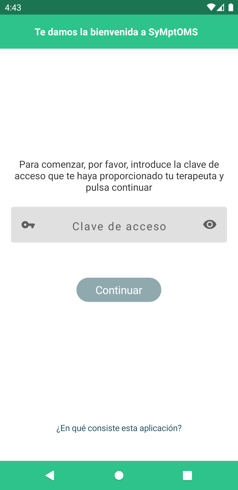
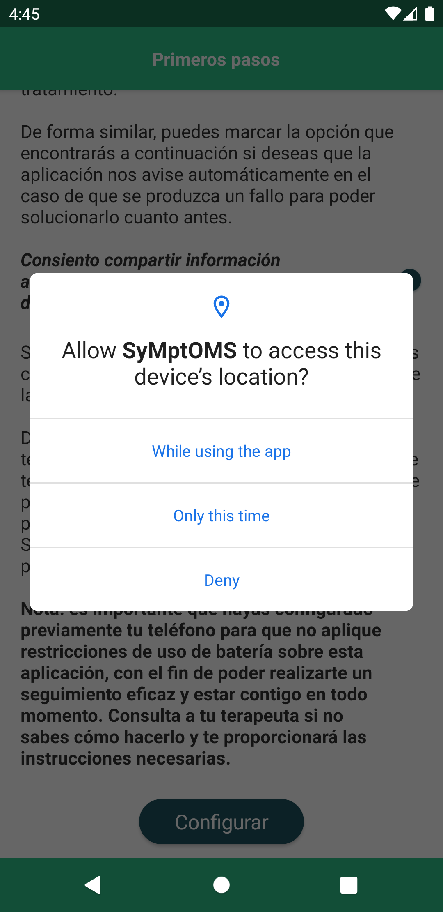
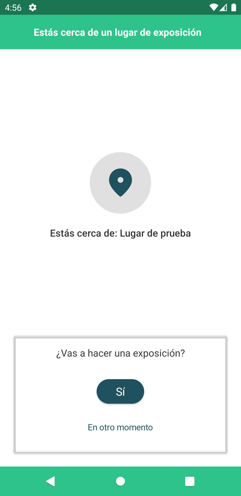
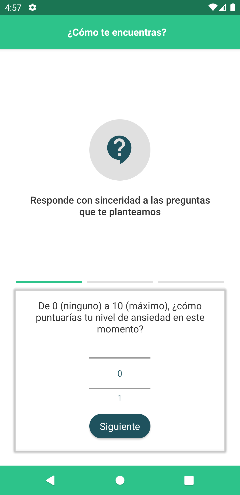
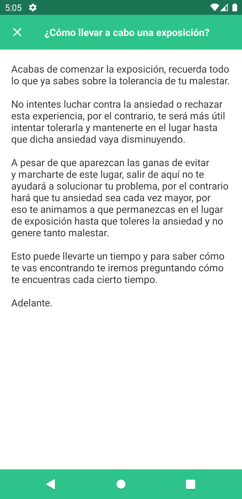
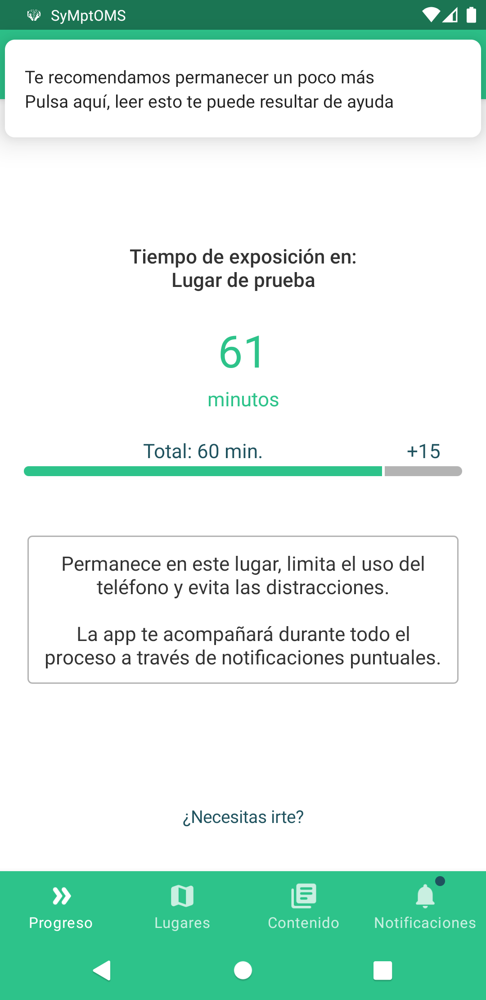
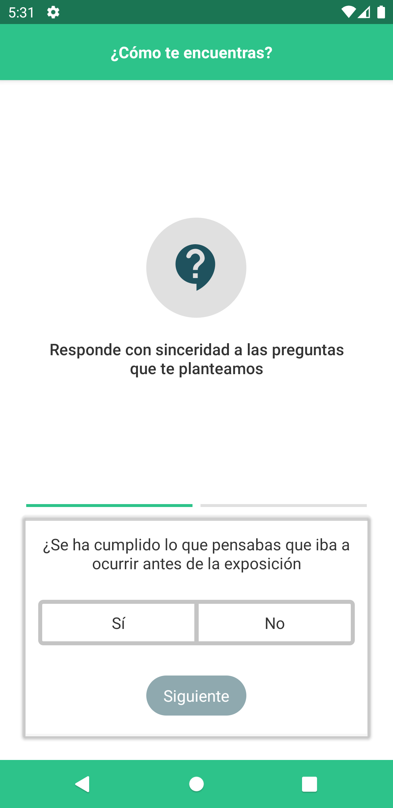
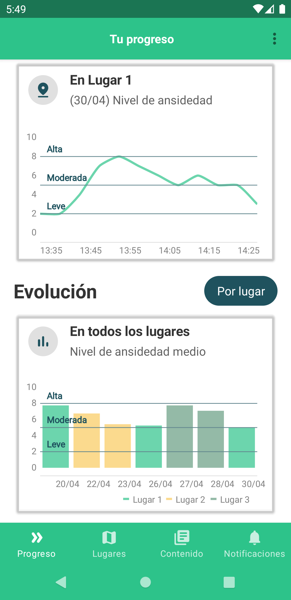

# SyMptOMS Mobile App 

The SyMptOMS Mobile App has been designed to support psychological treatment. It develops its full potential when used in blended format. Currently, it supports the treatment of anxiety disorders where the emotional response is exacerbated at concrete geographical areas, although it is planned to support other disorders in the future too. Its current version is also known as SyMptOMS-ET (ET stands for Exposure Therapy).

## How will the patient use this app?

The basic usage of the application is as follows:

| Step                                                                                                                                                                                                                                                                                                                                                     | Screenshot                                                                                                                                                                                                                                                                                                                                         |
|----------------------------------------------------------------------------------------------------------------------------------------------------------------------------------------------------------------------------------------------------------------------------------------------------------------------------------------------------------|----------------------------------------------------------------------------------------------------------------------------------------------------------------------------------------------------------------------------------------------------------------------------------------------------------------------------------------------------|
| 1. The app expects a patient profile to be linked to an app install. No personal details are required in that profile, although it can be extended to include them if needed. Patients are expected to link their personal profile with a current app installation using a one-time password (OTP) during application setup.                             |                                                                                                                                                                                |
| 2. The app requires location and physical activity access permissions, jointly to disabled battery savings to work. The patient must give his/her consent.                                                                                                                                                                                               |                                                                                                                                                                                                           |
| 3. Upon approaching an already-set-up exposure area (more details on how to set-up exposure areas in [How do I deploy the app?](#how-do-i-deploy-the-app) section). The patient will be asked for his/her exposure intention.                                                                                                                            |                                                                                                                                                     |
| 4. The app delivers pre-exposure assessments upon exposure confirmation.                                                                                                                                                                                                                                                                                 |                                                                                   |
| 5. Upon entering the exposure area. The app delivers exposure instructions. On a fixed interval, new assessments are delivered. The assessment interval can be configured (see [Pre-deployment application configuration options](#pre-deployment-application-configuration-options) section).                                                           |                                                                                                                                                                      |
| 6. After a determined interval, the answers to the assessments delivered during the exposure are evaluated to decide if the exposure can finish or the patient should stay more time. Exposure and time extension duration are configurable (see [Pre-deployment application configuration options](#pre-deployment-application-configuration-options)). |                                                                                                                                                                             |
| 7. Upon successful finalization, the application delivers post-exposure assessments.                                                                                                                                                                                                                                                                     |                                                                                                                      |
| 8. After several exposures, the patient can see how he/she progresses at the given exposure areas.                                                                                                                                                                                                                                                       |  |

More details on how the application works in our related paper: _"A Fully Instrumentalised Geolocation- And Smartphone-Based Exposure Therapy for Anxiety Disorders: SyMptOMS-ET"_ (not yet in press, email `algonzal at uji dot es` for a preprint).

## How do I deploy the app?

1. A Firebase project is needed for application authentication. The application uses anonymous authentication, so the provider must be activated in the project. The application only works in Android devices for now. Add a new Android application to the firebase project and copy the generated `google-services.json` file inside the `App_Resources/Android` folder.
2. A Mapbox API token is needed for the map to work. Create a [free Mapbox account](https://account.mapbox.com/auth/signup/) and generate access tokens for both [test](src/environments/environment.tst.ts) and [production](src/environments/environment.prod.ts) environments if you wish to use this functionality.
3. Prepare your system to work with NativeScript following the Android [setup instructions at its website](https://docs.nativescript.org/environment-setup.html).
4. The current version of the application uses the SyMptOMS server to retrieve the patient profile. The SyMptOMS server has not been open-sourced yet, although its RPC client is available as a zip file inside the vendor folder. All server calls are isolated inside the [`src/app/core/server`](src/app/core/server) folder. A good way to start playing with the app is to replace those calls with Firebase database calls.
5. The last mandatory configuration step is to configure the exposure areas. Currently, exposure places can be configured directly from a configuration file, although its load is completely asynchronous and can be done from a server too, by editing [this file](src/app/core/framework/aois.ts).
6. Test the app on a local emulator or attached device running the `npm run android` command from the project's root folder.
7. Build an apk for testing with external users following NativeScript [instructions on releasing apps](https://docs.nativescript.org/releasing.html).

## Pre-deployment application configuration options

- The application welcome text and informed consent information can be updated from within [this file](src/app/views/welcome/tutorial/tutorial.component.html).
- Application always available and timely-intervention contents can be updated from [this file](src/app/views/treatment-content.service.ts).
- Exposure evaluation deadline and time extension durations can be both configured for [test](src/environments/environment.tst.ts) and [production](src/environments/environment.prod.ts) environments.
- Exposure [confirmation](src/app/core/modals/confirm/modals.ts), [assessment](src/app/core/modals/questions/modals.ts) and [feedback](src/app/core/modals/feedback/modals.ts) modals are configurable (follow the links on each one of the names). The same applies to [confirmation](src/app/core/dialogs/confirm/dialogs.ts) and [information](src/app/core/dialogs/info/dialogs.ts) dialogues.
- Notification texts and anxiety evaluation thresholds can be customised by editing the [exposure component specification](src/app/tasks/graph.ts).
- Application main screen tabs and texts can be configured and edited starting from [this file](src/app/views/main/main.component.html).

## Using SyMptOMS Mobile App in other languages

The SyMptOMS Mobile App has been tested by users living in Spain, hence its contents are in Spanish. On-screen texts can be altered by editing the files listed in the [previous section](#pre-deployment-application-configuration-options).

## Usage license

Apache-2.0 License (see [LICENSE](LICENSE) file).
